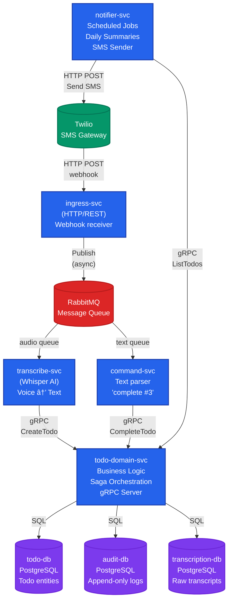

# SMS-Based Todo App - Microservices Architecture

## System Architecture Diagram



## Communication Patterns

| Pattern | Usage | Example |
|---------|-------|---------|
| **HTTP/REST** | External boundaries | Twilio webhooks → ingress-svc<br/>notifier-svc → Twilio API |
| **gRPC** | Internal service calls | command-svc → todo-domain-svc<br/>transcribe-svc → todo-domain-svc |
| **RabbitMQ** | Async workflows | ingress-svc → worker services |
| **SQL** | Database access | All services → PostgreSQL |

## Service Responsibilities

### ingress-svc
- Accepts Twilio webhooks
- Validates webhook signatures
- Responds 200 OK immediately (Twilio timeout = 15s)
- Publishes messages to RabbitMQ
- **Learn:** Webhook reliability, fast-path vs slow-path

### transcribe-svc
- Consumes audio processing queue
- Downloads audio files from Twilio
- Runs Whisper AI model for transcription
- Extracts actionable todo items using AI
- **Learn:** Heavy workload isolation, timeout handling, ARM64 resource limits

### command-svc
- Consumes text command queue
- Parses SMS text commands ("complete #3", "edit #2 buy milk")
- Accepts human-language commands, does not require strict protocol
- Generates idempotency keys
- Validates command syntax
- **Learn:** Command pattern, input validation, idempotency

### todo-domain-svc
- Core business logic (CRUD operations)
- Enforces business rules
- Orchestrates sagas for multi-step workflows
- Maintains consistency across databases
- Emits domain events
- **Learn:** Saga pattern, compensating transactions, event sourcing

### notifier-svc
- Runs scheduled jobs (cron) for daily summaries
- Queries todo-domain-svc for current todos
- Formats and sends SMS via Twilio API
- **Learn:** Distributed locking, at-least-once delivery, scheduled tasks

## Key Architecture Patterns

### 1. Failure Isolation
- Whisper crashes don't affect command processing
- Each service can fail independently
- Circuit breakers prevent cascade failures

### 2. Independent Scaling
- CPU-heavy transcription scales separately
- Command processing has different resource needs
- Kubernetes can scale services based on queue depth

### 3. Protocol Diversity
- External: HTTP/REST (compatibility, debugging)
- Internal: gRPC (performance, type safety)
- Async: RabbitMQ (decoupling, backpressure)

### 4. Database Separation
- **todo-db**: Mutable todo entities
- **audit-db**: Append-only event log (compliance, debugging)
- **transcription-db**: Raw transcripts (reprocessing, ML training)

## Example Flow: Voice Message → Todo Created

```
1. User sends voice SMS
   └─> Twilio → ingress-svc (HTTP webhook)

2. Ingress responds 200 OK immediately
   └─> Publishes to RabbitMQ audio queue

3. Transcribe worker consumes message
   ├─> Downloads audio from Twilio
   └─> Runs Whisper model (5-30 seconds)

4. Transcribe calls todo-domain-svc
   └─> gRPC: CreateTodo("Buy milk from store")

5. Domain service executes saga
   ├─> Write to todo-db
   ├─> Write to audit-db
   ├─> Write to transcription-db
   └─> Emit event for notifications

6. Notifier picks up event
   └─> Calls todo-domain-svc (gRPC: ListTodos)

7. Formats SMS with current todos
   └─> "Current todos: #1 Buy milk (new)"

8. Sends SMS via Twilio API
   └─> HTTP POST to Twilio
```

## Failure Scenarios & Handling

| Failure | Handling Strategy |
|---------|------------------|
| Whisper crashes | Message stays in RabbitMQ, automatic retry with exponential backoff |
| Duplicate webhook | Idempotency key prevents duplicate todo creation |
| Database unavailable | Saga compensation rolls back partial changes |
| Twilio SMS fails | Retry queue with dead letter exchange after max attempts |
| gRPC timeout | Circuit breaker opens, fallback behavior |
| Transcription takes too long | Queue visibility timeout, message requeued |

## Why This is Overengineered (But Great for Learning)

For **1 user**, you could write a single Python script. But this architecture teaches:

✅ **Real production patterns** used at scale (Uber, Netflix, Stripe)  
✅ **Failure modes** you'll encounter in distributed systems  
✅ **Different communication patterns** and their tradeoffs  
✅ **Saga orchestration** for multi-step workflows  
✅ **Resource constraints** on ARM64 (your Pi cluster)  
✅ **Protocol diversity** (HTTP, gRPC, message queues)

At scale (1000s of users):
- Separation enables independent team ownership
- Scaling becomes granular (5 transcribe pods, 2 command pods)
- Failures are isolated (one service down ≠ entire system down)
- Deployment is safer (gradual rollout per service)

## Technology Stack

| Component | Technology | Why |
|-----------|-----------|-----|
| Services | **Go** | Efficient on ARM64, strong concurrency, low memory |
| Message Queue | **RabbitMQ** | Mature, supports multiple patterns, good monitoring |
| Databases | **PostgreSQL** | ACID guarantees, jsonb for flexibility |
| Internal RPC | **gRPC + Protobuf** | Type-safe, efficient, streaming support |
| External API | **HTTP/REST** | Universal compatibility, easy debugging |
| Orchestration | **Kubernetes (k3s)** | Lightweight for Pi, production-grade patterns |
| IaC | **Terraform** | Declarative infrastructure, version control |
| Observability | **Prometheus + Grafana + Loki** | Metrics, visualization, log aggregation |

## Next Steps

1. **Project structure setup** - Create Go modules, proto definitions
2. **RabbitMQ topology** - Design exchanges, queues, bindings
3. **Protobuf schemas** - Define service contracts
4. **Implement ingress-svc** - First service (webhook receiver)
5. **Kubernetes manifests** - Deployment configs for Pi cluster
